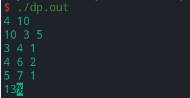

 # 实验2：动态规划问题

**PB19000196 晏瑞然**

## 问题描述

**多重背包问题：** 一位旅行者能承受的背包最大重量是 $b$ 千克，现有$n$ 种物品供他选择装入背包，第 $i$ 种物品单件重量为 $a_i$ 千克，最多有 $s_i$ 件，每件的价值为 $c_i, 1 \leq i \leq n$. 设第 $i$ 种物品装载数量是 $x_i$ ，问旅行者应该如何选择所携带的物品件数，以使得总装载价值最大.

## 算法原理

采用动态规划的的思想，将问题划分为重叠的子问题进行求解。

具体来说，令 $dp[i][j]$ 表示前 $i$ 种物品背包最大承重为 $j$ 时所能装载的最大价值。对于每种物品 $i$ 因为其有 $s_i$ 件，设取该物品的件数为 $k$ ，则 $k$ 的范围就是 $[0,s_i]$ 。由此可得其状态转移方程：
$$
dp[i][j] = \max(dp[i-1][j-k*a_i]+k*c_i),k \in [0,s_i],k*a_i \in [0,j]
$$
上式表示前 $i$ 种物品背包最大承重为 $j$ 时所能装载的最大价值取决于第 $i$ 件物品取几件。当我们假设知道了子问题 $dp[i-1][j-k*a_i]+k*c_i$ 的解时，就能查找到对应第 $i$ 件物品取不同件数时能装的价值，取其最大即可得到最优解。

然后可以确立其边界条件
$$
\forall i,dp[i][0] = dp[0][i] = 0
$$
上式表示背包承重为0时最大承重为0，以及没有物品时最大承重为0，很好理解。

## 数据集说明

程序可手动输入数据集，具体测试数据集见**程序测试结果**。

## 程序输入输出说明

**INPUT：**

第一行n,W分别标是物品件数和背包容量，之后n行表示每种物品的weight value number

**OUTPUT：**

能装入背包的最大价值

## 程序运行说明

本实验语言使用C++，提交源文件dp.cpp，使用方法如下：

1. 可直接使用IDE如DEVC++直接运行，运行后在命令行窗口中输入INPUT，程序会运行给出OUTPUT
2. 在命令行下的源文件目录下依次输入`g++ dp.cpp -o dp.out`，`./dp.out`，之后在命令行窗口中输入INPUT，程序会运行给出OUTPUT

本实验测试直接用第二种方式运行程序。

## 程序测试结果

测试1:

数据集：

```bash
4 10
10 3 5
3 4 1
4 6 2
5 7 1
```

结果如下：



最后一行即为结果，可以看到输出结果为13。

经验证，结果正确。

测试2:

数据集：

```bash
3 12
1 2 3
2 3 2
3 7 2
```

结果如下：


输出结果为24。

经验证，结果正确。

## 分析总结

### 复杂度分析

时间复杂度：从程序可直接看出，所花时间为O(K)，其中K为所有物品个数，为线性复杂度，速度非常快，相比于递归或暴力求解，大大减少了时间开销。

空间复杂度：减少时间开销的代价就是增加了空间复杂度，所用空间开销为O(N*M)，主要用处是记录所有子问题的答案。

### 总结

动态规划算法最重要的就是找到最优子结构根据其构造状态转移方程，找到最优子结构后就能用空间交换时间，通过保存记录之前的状态以及转移方程得到新的状态。这也是一种分治的思想，能让一个复杂的问题简单化，灵活运用这种思想能帮助我们有效解决很多问题。
